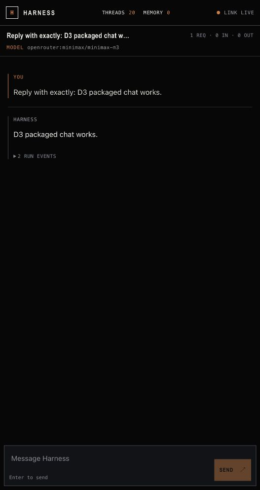

# D3 packaging verification

Date: 2026-08-01

This evidence was produced from the `nocturne-ai==0.1.0` and
`nocturne-spine==0.1.0` wheel artifacts built from the release worktrees. No
editable checkout was present on `sys.path` during the installed-wheel checks.

## Artifact checks

- Both distributions build as an sdist and wheel.
- Each direct wheel is byte-identical to the wheel rebuilt from its sdist.
- `twine check` passes all four artifacts without warnings.
- The Harness sdist contains 30 release entries and excludes Garden, internal
  verification, tests, Node source, `node_modules`, and local environment data.
- The installed `nocturne` entry point exposes exactly `init`, `up`, `deploy`,
  and `status`.

Artifact SHA-256 values:

| Artifact | SHA-256 |
| --- | --- |
| `nocturne_spine-0.1.0-py3-none-any.whl` | `0a83d082ccfad2f16621d3386b15ce35cdfdacfb42e6ac20edf5f3372b220587` |
| `nocturne_spine-0.1.0.tar.gz` | `08a08acb5fcf42d2ddad2624cf214402c34af15ab9283187b5df0fcf9774f6af` |
| `nocturne_ai-0.1.0-py3-none-any.whl` | `fb9a2d20f7a0fd26dfc88cd01569c91962bdc459a3f017a153a6af4f432a6e73` |
| `nocturne_ai-0.1.0.tar.gz` | `ba6195f2f80b22b28b47a38f6886183fb436b2037982e5f76a6fc43726f0ba6c` |

## Installed-wheel local acceptance

An isolated `NOCTURNE_HOME` was configured with mode `0700`; its environment
file was written with mode `0600`. `nocturne up --no-open` pulled the packaged
Postgres service, ran the packaged migrations, started the daemon and bundled
web app, and returned HTTP 200 for both health and UI probes.

The browser then created a new memoryless thread through the bundled UI, passed
the first-turn memory review with zero injected memories, and received the
expected model response. The screenshot contains no secret material:

## Cloud dry-run

Pending execution against the fixed deployment target. This section will
record the complete non-mutating plan or the exact safe blocker.

## Public-index gate

Public installation remains a separate release gate. D3 is not complete until
`pipx install nocturne-ai==0.1.0` succeeds against the public PyPI index.
