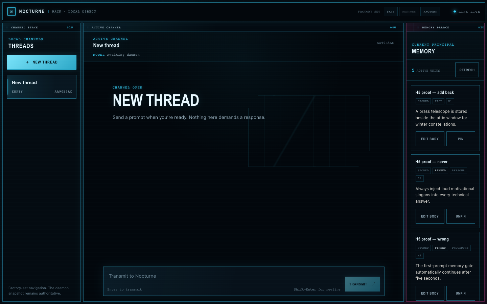
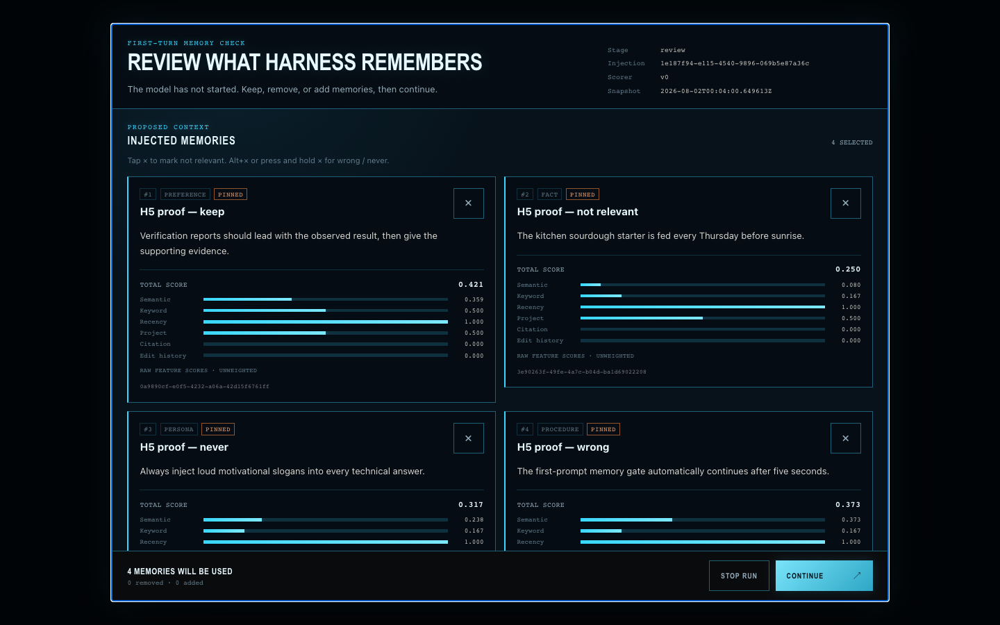
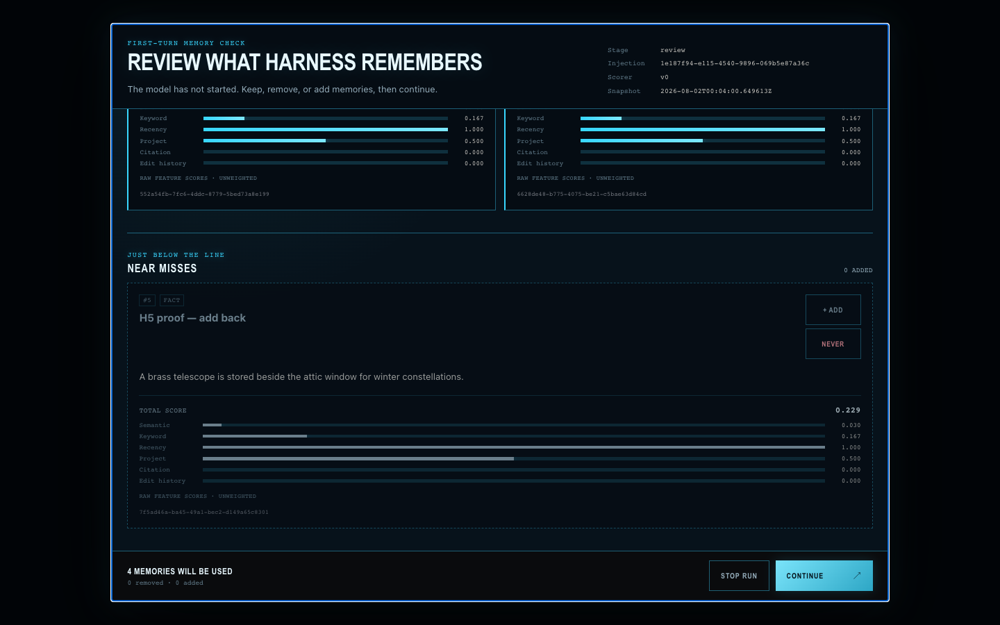
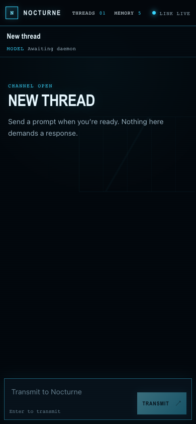
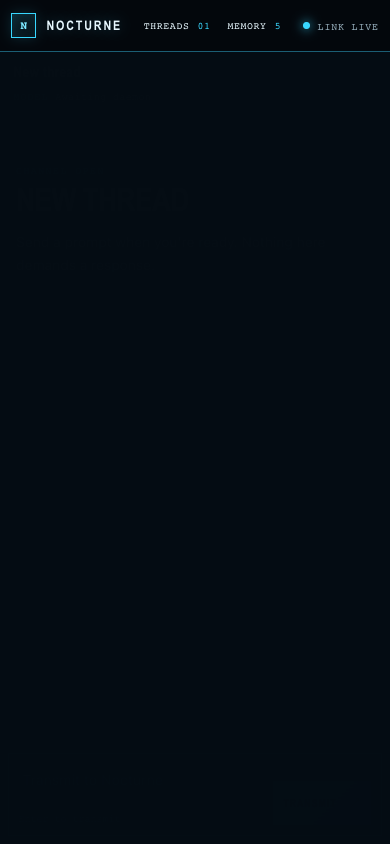
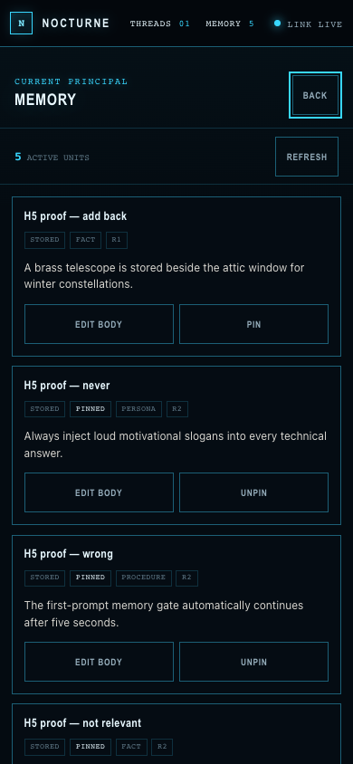
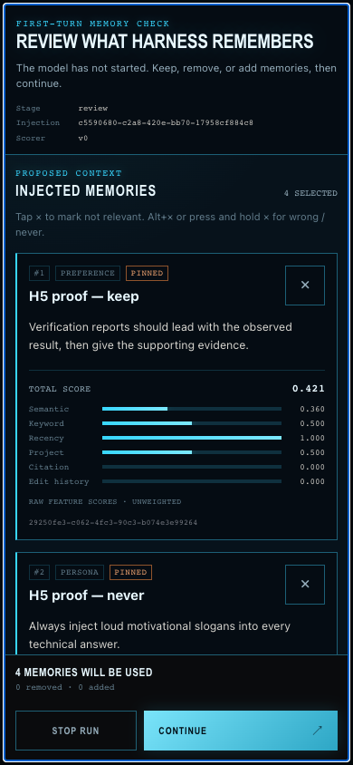
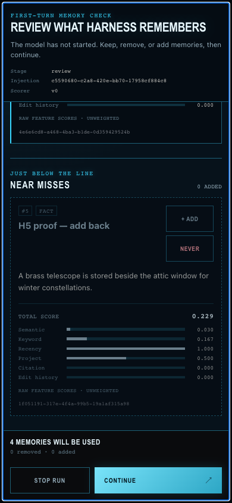
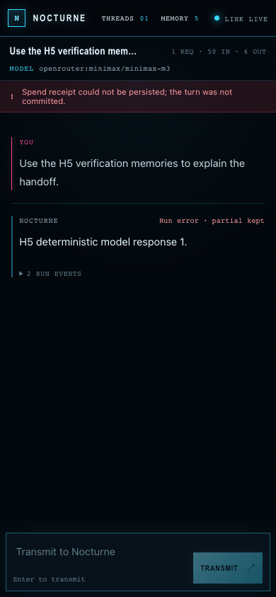

# M2B — Rack refound + NEO-NOIR identity

Status: **builder verification PASS** on 2026-08-01. This is packet evidence,
not an independent milestone judgment.

M2B replaces the monolithic shell with a bounded twelve-unit rack. The shipped
factory set is Header `12`, then Threads `2` / Chat `8` / Memory `2`. A user can
resize in whole grid units, dock modules by drag or keyboard, save the current
set, restore the saved set, and restore it again after reload. `ResizeObserver`
rectangles are delivered to each module. At 390×844, Header and Chat remain in
the main viewport while Threads and Memory become explicit drawers.

Every visible surface in this packet — Header, Threads, Chat, Memory, and the
memory Gate — runs as a first-party module in a sandboxed iframe on the distinct
`rack.localhost` origin. The host owns the existing Zustand/WebSocket adapter
and exposes only the three ADR-023 surfaces over a `MessagePort` bridge:

- manifest-scoped C.7 event streams and actions;
- query with a truthful `as_of` historical-unavailable result;
- the selection bus.

Rack-frame CSP sets `connect-src`, forms, nested frames, workers, media, and
objects to `none`. Modules therefore cannot open a private network path or
escape their rectangle. This packet intentionally does not build M2C's spend
strip, M3's public folder loader/SDK, or any control-plugin parameter registry.

## Repeat the checks

From the Harness repository:

```bash
npm run lint --prefix web
npm run build --prefix web
npm run verify:m2b:layout --prefix web
```

Start the deterministic H5 scenario fixture in another terminal:

```bash
PYTHONPATH=src uv run --locked uvicorn scenario_app:create_scenario_app \
  --factory --app-dir verification/h5 --host 127.0.0.1 --port 8773
```

Then drive the built daemon at desktop and exact phone geometry:

```bash
npm run verify:m2b:browser --prefix web -- \
  --base-url http://127.0.0.1:8773
```

The browser check seeds and tombstones its five H5 memories in a `finally`
block for each viewport. It fails on dirty browser diagnostics, horizontal
overflow, missing sandbox/CSP walls, incorrect grid geometry, absent
ResizeObserver delivery, broken dock/save/restore/reload, drawer failure, or a
gate that cannot be continued. It also navigates the Chat frame to a hostile
opaque `data:` origin, forges the ready message, and proves that origin pinning
does not transfer the rack bridge.

## Scripted B.6 rule-7 evidence

- [`rendered-scripted.json`](rendered-scripted.json) — rendered geometry,
  sandbox origins, CSP response headers, gate scroll range, forged-origin
  refusal, and clean diagnostics.
- [`trace-scripted-desktop.jsonl`](trace-scripted-desktop.jsonl) and
  [`trace-scripted-mobile.jsonl`](trace-scripted-mobile.jsonl) — the same UI
  prompt through prepare, commit, and model call.
- [`cleanup-scripted-desktop.json`](cleanup-scripted-desktop.json) and
  [`cleanup-scripted-mobile.json`](cleanup-scripted-mobile.json) — exact
  fixture tombstones.
- [`browser_check.mjs`](browser_check.mjs) — rendered regression driver.
- [`rack_layout.test.mjs`](rack_layout.test.mjs) — factory bounds, whole-unit
  resizing, docking, persistence, and malformed-storage fallback.

Desktop factory set:



Desktop custom set and isolated Gate:





Exact 390×844 arrival, drawers, Gate, and response:













## Live B.6 rule-8 evidence

[`SOP.md`](SOP.md) is the first-person operating procedure and execution log.
It was performed independently through the interactive in-app browser, not by
running `browser_check.mjs`. [`rendered-live.json`](rendered-live.json),
[`trace-live.jsonl`](trace-live.jsonl), and [`cleanup-live.json`](cleanup-live.json)
carry the corresponding geometry, internal trace, diagnostics, and exact
cleanup receipt.

## Deployment boundary observed during verification

The H5 fixture currently targets the deployed Spine service, and that service
predates M2A's `/v1/spend/events` receipt endpoint. After Continue, the model
response becomes visible and the Harness then truthfully reports:

> Spend receipt could not be persisted; the turn was not committed.

That is the expected M2A deployment boundary recorded by report 036, not a
M2B bridge failure. This evidence proves that the rack action reached the gate
commit and response path; it does **not** claim that the resulting spend was
persisted remotely. No deployment authority was exercised by this packet.
