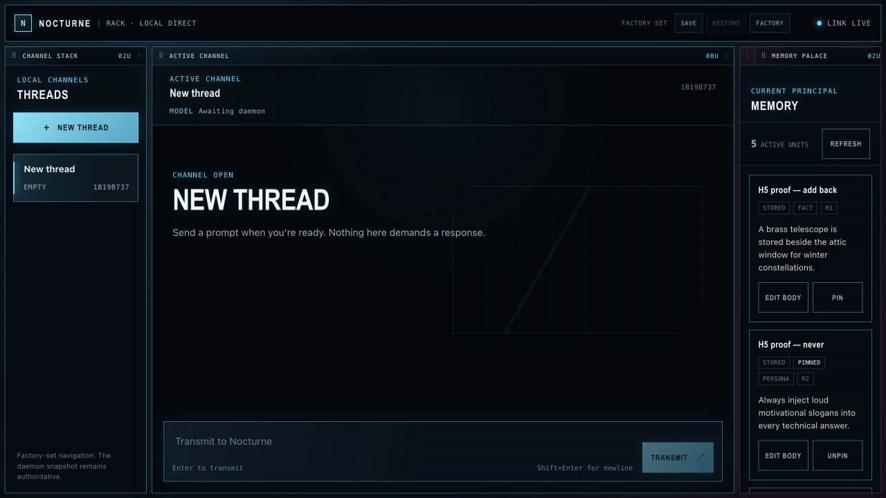
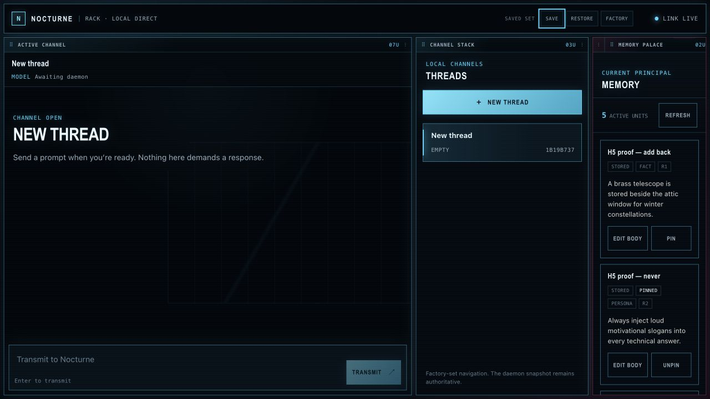
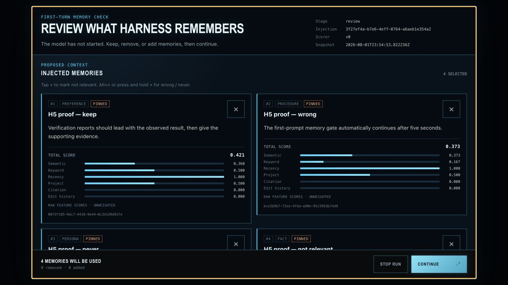
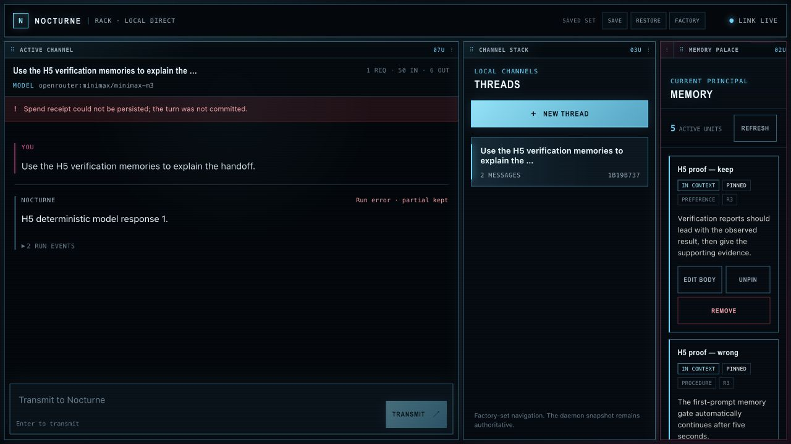
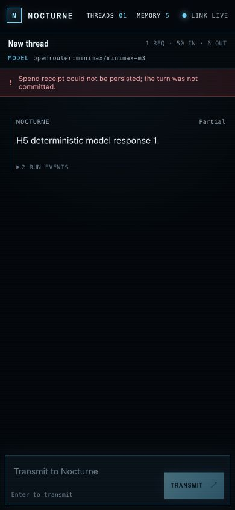
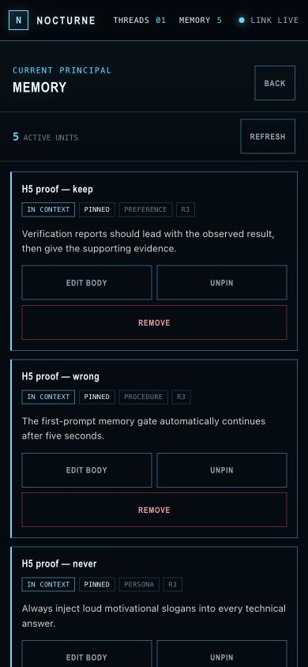
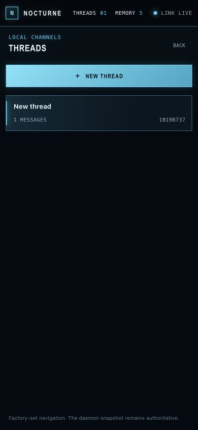
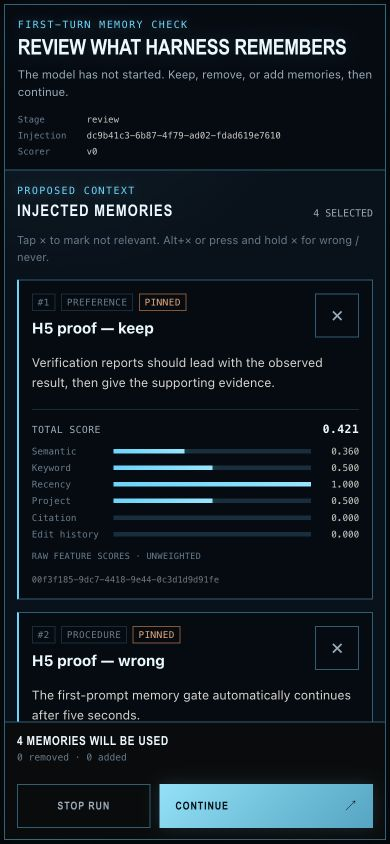
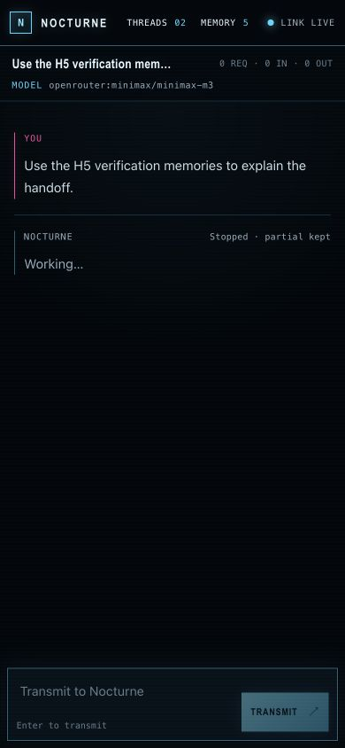

# M2B live operating procedure and execution log

Executed 2026-08-01 through the interactive in-app browser against the real
built Harness daemon and H5 scenario fixture at `http://127.0.0.1:8773`.
Nothing in this pass was replayed by `browser_check.mjs`. I inspected each
rendered state before deciding what to do next.

## Desktop pass — 1280×720

### 1. Arrive as the owner

**Action.** I opened the app at 1280×720, waited for `Link live`, and did not
touch the factory set.

**Observation.** The screen read as an instrument rack immediately: a narrow
cyan command bar, dark bounded devices, magenta secondary marks, and one quiet
central work surface. Threads, Chat, and Memory were all simultaneously
legible without turning the page into three competing dashboards. I saw no
horizontal overflow, loading residue, warning, or accidental browser chrome.

### 2. Resize, dock, and save a set

**Action.** I focused the Threads dock control, used its keyboard resize affordance
to grow Threads from two to three units, moved it right with `Alt+ArrowRight`,
and pressed **Save set**.

**Observation.** The rack settled at Chat `7` / Threads `3` / Memory `2` with
no overlap or clipped copy. Both Threads and Chat reported a new resize
sequence, so the change reached the module faces rather than only moving host
boxes. `Saved set` appeared as a restrained status, not a toast demanding
attention. The keyboard path is much easier to place precisely than a drag;
the drag handles remain visually discoverable without dominating the face.

### 3. Use the re-founded Chat and Gate

**Action.** Inside the Chat module I typed the fixture's first prompt,
`Help me prepare a verification report for the memory gate.`, and sent it. I
waited for the memory Gate to appear before touching it.

**Observation.** The Gate arrived as a fifth sandboxed rack surface over the
custom set. Five full cards, scores, removal controls, and the Continue/Stop
boundary were readable. It felt related to the rack rather than pasted on:
same glass, borders, typography, and cyan/magenta hierarchy. More importantly,
the hard pause remained unmistakable; the visual refound did not soften the
existing law-bound decision.

### 4. Continue and watch the same action cross the bridge

**Action.** I pressed **Continue** once and waited for the Gate to close and the
model result to settle.

**Observation.** The deterministic response appeared in Chat, proving the Gate
action crossed the sandbox bridge into the existing C.7 flow. The run then
ended with the visible message `Spend receipt could not be persisted; the turn
was not committed.` This is real friction, not cosmetic noise: the H5 fixture's
deployed Spine target is still pre-M2A and has no receipt endpoint. I did not
reinterpret the red state as success or claim a persisted spend. The partial
response remained readable, which is the honest terminal behavior built by
M2A.

## Phone pass — exact 390×844

### 5. Arrive at the required phone geometry

**Action.** I opened a fresh app view at exactly 390×844 and waited for
hydration to finish.

**Observation.** Header and Chat occupied exactly the viewport width
(`clientWidth = scrollWidth = 390`). Threads and Memory were absent from the
main flow rather than squeezed into unusable strips. The composer remained
reachable above the bottom edge, and the empty state still had breathing room.

### 6. Pull Memory into view

**Action.** I tapped the Memory control in the header, read the drawer, and
closed it.

**Observation.** Memory used the full work area beneath the header, with the
close control and cards inside the viewport. It felt like the same device moved
forward, not a separate mobile rewrite. The underlying Chat stayed put and
returned without losing its state.

### 7. Pull Threads into view

**Action.** I tapped the Threads control, created a new thread, inspected the
list, and closed the drawer.

**Observation.** The drawer made the current thread and **New thread** action
obvious without leaving a permanent navigation tax. Creating a thread returned
me to a clean Chat face. There was no sideways movement or clipped row.

### 8. Unscripted odd-input probe, then open the Gate

**Action.** As the required unscripted exploration, I typed only spaces into
the composer. Send stayed disabled. I selected and deleted the spaces, then
typed the real H5 prompt and sent it.

**Observation.** Whitespace did not create a junk turn. The real prompt opened
the full Gate at phone width; card bodies wrapped cleanly, the action footer
stayed visible, and no horizontal overflow appeared. This was the point where
the phone version stopped feeling like a reduced desktop layout and felt like
an intentional instrument face.

### 9. Try to disturb the long Gate

**Action.** I issued a downward wheel gesture over the Gate body and captured
the resulting state before choosing an action.

**Observation.** The gesture produced no visible pixel delta from the prior
state. I therefore do not count this particular gesture as proof that the
interactive browser routed scrolling into the iframe. It also did not dislodge
the footer, cause background scroll, or break the layout. The scripted rendered
pass separately exercises scrolling through the real Gate and captures all
acceptance states; this live note keeps the ambiguous interaction visible
rather than manufacturing a success.

### 10. Stop instead of spending

**Action.** I pressed **Stop Run** on the phone Gate and waited for it to close.

**Observation.** The Gate disappeared, the stopped turn remained visible as a
partial state, and the composer returned. This exercised the alternate
law-bound Gate action through the sandbox bridge without making a second model
call. It was calm and reversible.

## Feel verdict

**YES — it belongs to the mock's family.** The factory layout has the Cube
mock's instrument-panel density, cyan/magenta light grammar, deliberate glass,
and quiet central void, while staying a two-dimensional M2 rack rather than
prematurely building the M3 Cube. The old plain-shirt feeling is gone.

The honest caveats are narrow: drag placement is inherently less exact than
the keyboard docking path, the live phone wheel gesture was visually
inconclusive, and the current deployed Spine cannot yet accept M2A receipts.
None is hidden here. Browser warnings and errors attributable to the rack were
empty in both views; [`rendered-live.json`](rendered-live.json) records the
geometry and diagnostics.

## Trace and cleanup

[`trace-live.jsonl`](trace-live.jsonl) follows the same desktop Continue and
phone Stop actions through scenario seed, Spine prepare/commit, model call,
and final cleanup. [`cleanup-live.json`](cleanup-live.json) records exact
tombstoning of all five seeded H5 memory IDs. No live fixture was left behind.
