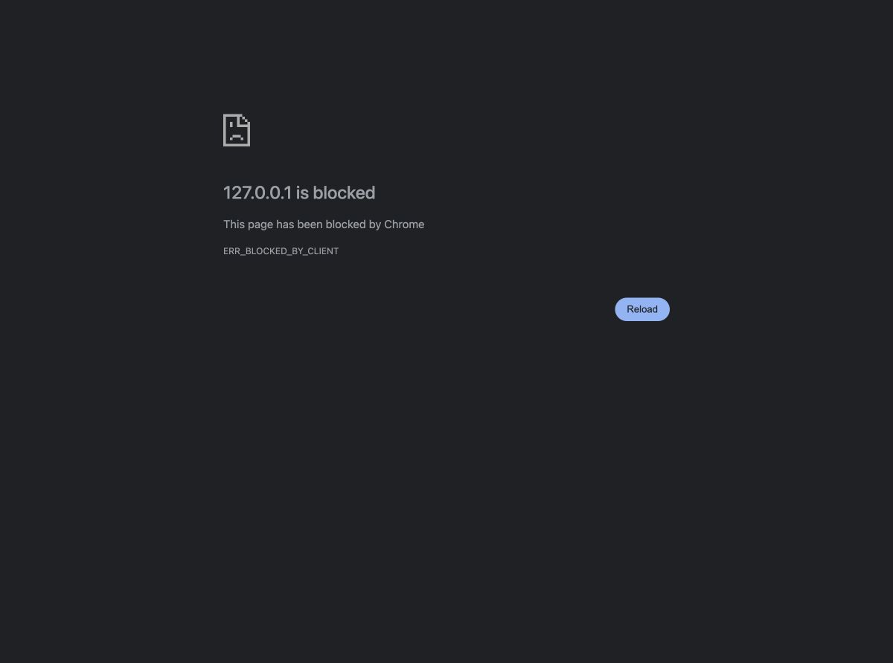

# M3OR fresh-session verification checkpoint

Session `or27` claimed M3OR through Garden PR 54. **IN_PROGRESS, not DONE.**
The fifteen-row browser walk and captures remain incomplete: both Chrome and
the in-app browser block the scratch app with `ERR_BLOCKED_BY_CLIENT`.
An explicit request to use Playwright, or restored local browser access, is pending.

| Check | Before → observed result |
|---|---|
| Public baseline | Both packages installed from PyPI at 0.1.35; real Palace/OpenRouter heartbeat and queued/interjected turns succeeded. |
| Retry commit | A real continuation stopped on an empty cherry-pick → retaining redundant commits replayed that exact commit successfully. |
| Judge working directory | Checks ran from judge metadata → instructions now direct judges into the candidate directory. |
| No surviving candidate | A terminated worker left judges selecting absent candidates or returning invalid feedback → instructions name the sealed brief as evidence and require FAIL without a selection. |
| Final recovery | With installed candidate workers and GPT-4.1, one deliberate worker death produced judge feedback, a fresh round and unanimous completion; the accepted foundation commit remained unchanged. Recorded run spend: $0.12145. |

The final Harness suite passed **1,798 tests** (4 skipped, 3 live contracts
deselected); Memory ground passed **322** (3 skipped). Worker/round checks,
Ruff and test motivations passed. Memory's first failure was stale editable
distribution metadata and passed after refreshing it.

Earlier GPT-4.1-mini runs and their failures remain in `runtime-traces.tar.gz`.
The first candidate daemon still launched released workers because process
isolation strips `PYTHONPATH`; it does not validate the worker instruction
changes. Later runs used a separately installed candidate. A faulty verification
command used unavailable `python`; the final recipe uses `python3`. No product
change was made for that fixture error.

`walk-observations.json` records all fifteen charged rows without claiming UI
acceptance. `ledger-report.json` is an unfinished generated report for the
repair's three mapped rows; no coverage PASS, UI canon PASS, release, or DONE
handoff is claimed. The source changes are five lines plus their decision note.

Cleanup receipt: one active disposable memory and three pending cards became
**zero active and zero pending**. Evidence excludes all credential files and
passed an exact credential-content scan. No owner home or owner principal was used.

Resume with the browser permission resolved, rewalk on a fresh disposable home,
complete all fifteen captures and packet-aware canon, then use the standing
release grant for the next unused paired version if the final repair stands.
